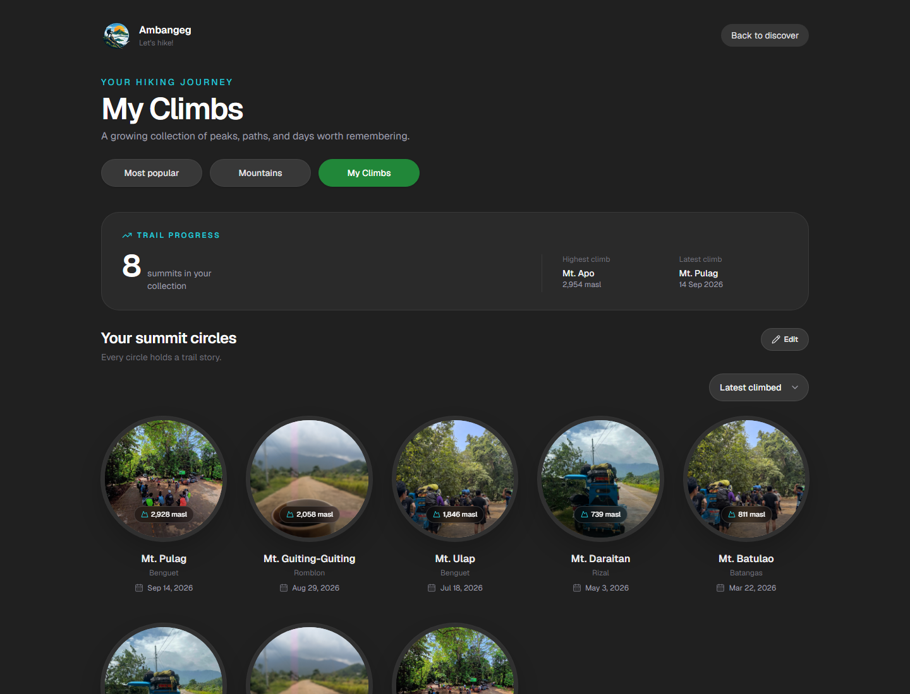

# Ambangeg

Ambangeg is a responsive hiking discovery experience for finding scenic trails and planning the next outdoor trip. It pairs a focused dark interface with real trail photography, category browsing, personalized bag-tag creation, and expanded trip-detail views.

## Preview

The home screen keeps the full-width **Flex My Hike** creator above the trail cards. Its live bag-tag preview sits beside the form on larger screens and stacks below it on mobile.

### Desktop


### Mobile


### My Climbs

The My Climbs collection keeps up to three pinned mountains at the front of the same responsive grid. Pin choices are stored locally in the browser until a database-backed profile is connected.

#### Desktop



#### Mobile


## Features

- Responsive layouts for desktop and mobile
- Personalized mountain bag tags with a downloadable PNG
- Browseable trail cards and category tabs
- Real hiking photography with proportional image cropping
- Interactive trip-detail views for each featured trail
- Sortable My Climbs gallery with up to three locally persisted pinned mountains
- Compact mobile header and desktop navigation
- Custom Ambangeg branding and favicon

## Built with

- [Next.js](https://nextjs.org/)
- [React](https://react.dev/)
- [TypeScript](https://www.typescriptlang.org/)
- [Tailwind CSS](https://tailwindcss.com/)
- [Base UI](https://base-ui.com/)
- [Lucide](https://lucide.dev/)

## Run locally

```bash
cd frontend
npm install
npm run dev
```

Open [http://localhost:3000](http://localhost:3000) in your browser.

## Production checks

```bash
cd frontend
npm run lint
npm run build
```
