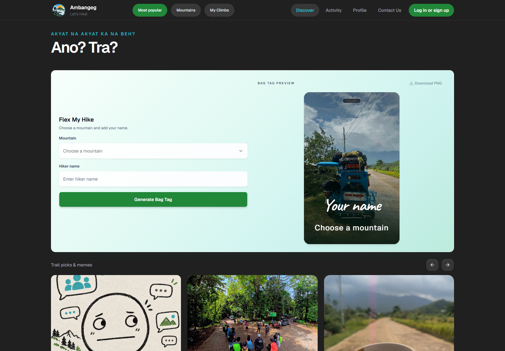
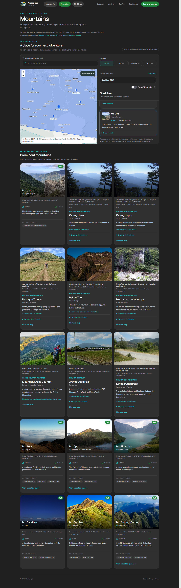
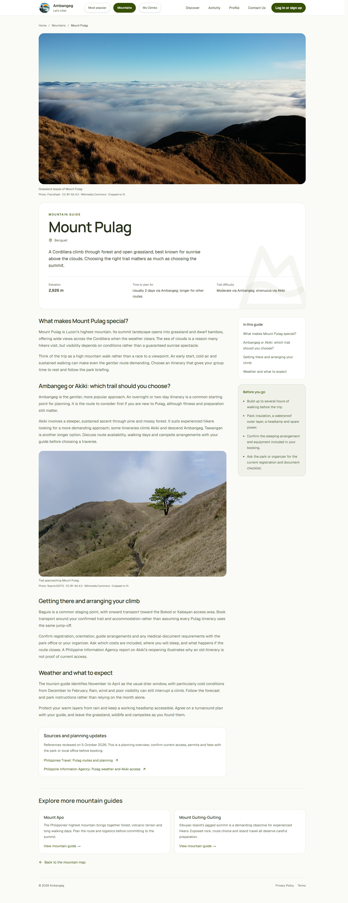
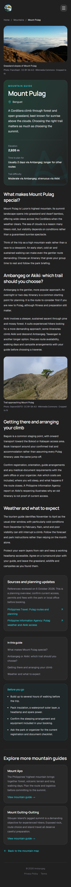
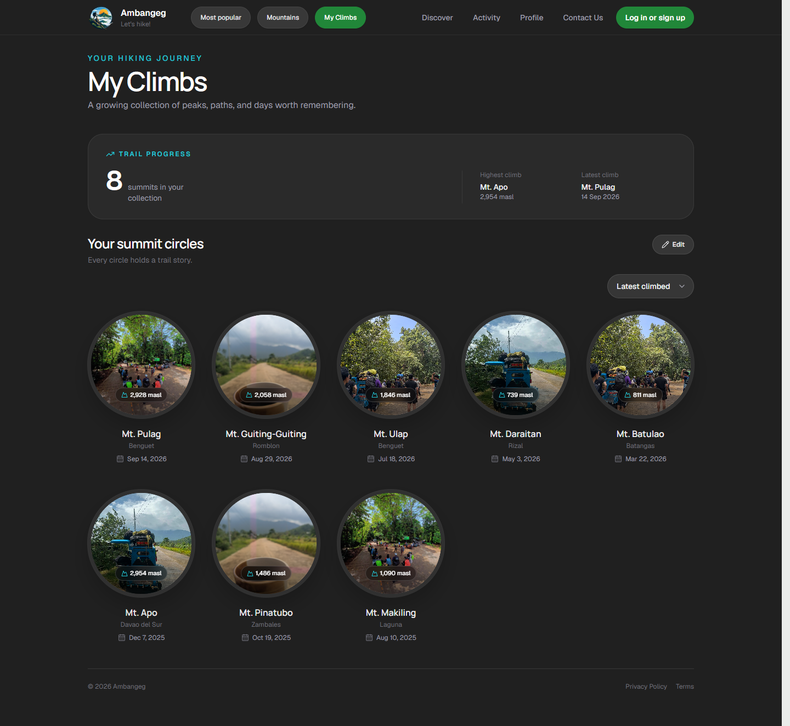
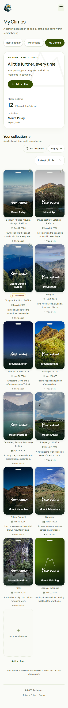

# Ambangeg

Ambangeg is a responsive Philippine hiking discovery app. Explore mountains on an interactive map, compare trails and difficulty, read mountain guides, create personalized bag tags, and keep a gallery of your climbs.

The Mountains explorer connects map pins to mountain cards: selecting either focuses the map and highlights the matching mountain. Desktop shows the map and list side by side; mobile uses a collapsible bottom sheet that keeps the selected peak visible above the list.

## Preview

The home screen keeps the full-width **Flex My Hike** creator above the trail cards. Its live bag-tag preview sits beside the form on larger screens and stacks below it on mobile.

### Desktop



### Mobile


### Mountains

Browse the mountain catalogue by climbing area, search terms and difficulty. Pins and cards share selection, with smooth camera movement, a subtle blue card highlight and a separate **View mountain guide** link. The reset button shows zoom steps relative to the country view.

#### Desktop



#### Mobile


### Mountain guides

The first dedicated guides cover **Mount Pulag**, **Mount Apo** and **Mount Guiting-Guiting**. Each includes route comparisons, access planning, preparation advice, dated source references and related guides. Current permits, fees and opening status should be confirmed with the park or local office.

| Mountain | Guide URL |
| --- | --- |
| Mount Pulag | `/mountains/mount-pulag/` |
| Mount Apo | `/mountains/mount-apo/` |
| Mount Guiting-Guiting | `/mountains/mount-guiting-guiting/` |

#### Desktop



#### Mobile



### My Climbs

The My Climbs collection keeps up to three pinned mountains at the front of the same responsive grid. Pin choices are stored locally in the browser until a database-backed profile is connected.

#### Desktop



#### Mobile



## Features

- Responsive layouts for desktop and mobile
- Interactive Philippine mountain map with climbing areas and labeled peak pins
- Search and difficulty filters for the mountain directory
- Synchronized map and card selection with smooth zoom and scrolling
- Collapsible mobile mountain list over the map
- Static hiking guides for Pulag, Apo and Guiting-Guiting
- Per-guide titles, descriptions, canonical URLs and breadcrumb structured data
- Personalized mountain bag tags with a downloadable PNG
- Browseable trail cards and category tabs
- Real hiking photography with proportional image cropping
- Interactive trip-detail views for each featured trail
- Sortable My Climbs gallery with up to three locally persisted pinned mountains
- Compact mobile header and desktop navigation
- Custom Ambangeg branding and favicon

## Built with

- [Next.js](https://nextjs.org/)
- [React](https://react.dev/)
- [TypeScript](https://www.typescriptlang.org/)
- [Tailwind CSS](https://tailwindcss.com/)
- [Base UI](https://base-ui.com/)
- [Lucide](https://lucide.dev/)
- [MapLibre GL JS](https://maplibre.org/)

The frontend exports static HTML with Next.js. Authentication uses Amazon Cognito; the contact form uses API Gateway, Lambda and SES with Cloudflare Turnstile. Hosting and service setup are documented in [frontend/README.md](frontend/README.md).

## Content

Mountain profiles live in `frontend/data/mountains.ts`, map coordinates in `frontend/data/map-mountains.ts`, and published guide content in `frontend/data/mountain-guides.ts`. Guide pages are generated at build time from the published guide list; adding a profile alone does not publish a guide. Review sources and update the guide’s review date when changing content.

Screenshots show the current static export at desktop and mobile sizes. Map imagery is supplied by OpenFreeMap with OpenStreetMap data and attribution displayed in the app.

## Run locally

```bash
cd frontend
npm install
npm run dev
```

Open [http://localhost:3000](http://localhost:3000) in your browser.

## Production checks

```bash
cd frontend
npm run lint
npm run build
```
