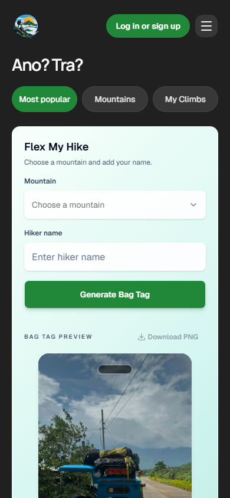
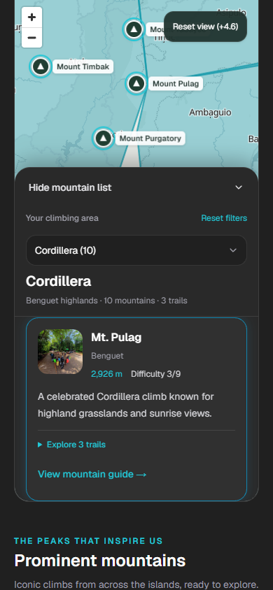
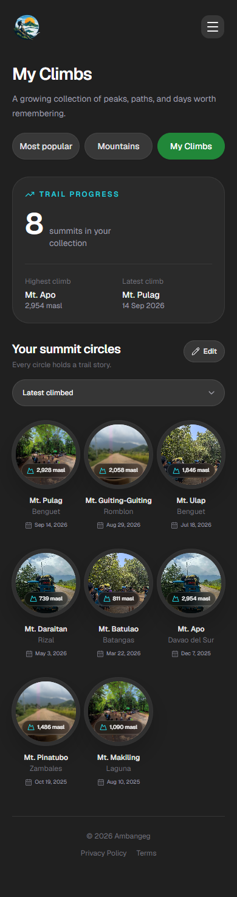
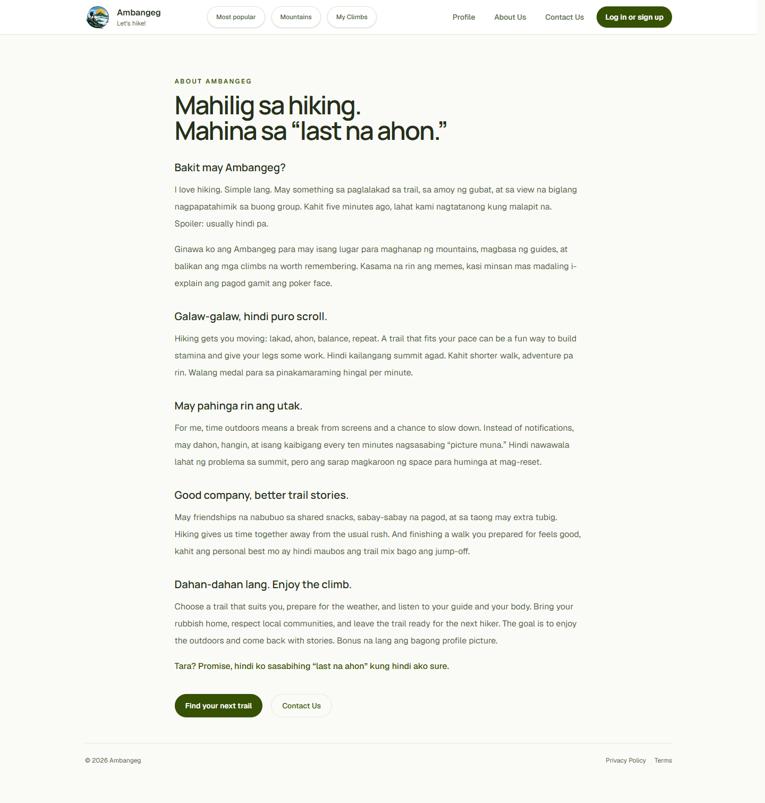

# Ambangeg

Ambangeg is a responsive Philippine hiking discovery app. Explore mountains on an interactive map, compare trails and difficulty, read mountain guides, create personalized bag tags, and keep a gallery of your climbs.

The Mountains explorer connects map pins to mountain cards: selecting either focuses the map and highlights the matching mountain. Desktop keeps search and filters in the right column beside the map; mobile moves them into the draggable bottom sheet.

## Preview

The home screen keeps the full-width **Flex My Hike** creator above three shareable hiking memes and featured article guides. Its live bag-tag preview sits beside the form on larger screens and stacks below it on mobile. Guide cards use an edge-to-edge image across one-third of the card.

### Desktop


### Mobile



### Mountains

Browse all 2,015 mountains by climbing area, search terms and difficulty. The map starts with 800 priority mountains; **Reveal All Mountains** displays the secondary layer, while selecting a hidden mountain reveals that peak individually. Region colors, touch-friendly area previews and shareable map coordinates help exploration. The mobile list has a draggable height handle, and touch gestures keep the map upright.

#### Desktop


#### Mobile



### Mountain guides

The first dedicated guides cover **Mount Pulag**, **Mount Apo** and **Mount Guiting-Guiting**. Each includes route comparisons, access planning, preparation advice, dated source references and related guides. Current permits, fees and opening status should be confirmed with the park or local office.

| Mountain | Guide URL |
| --- | --- |
| Mount Pulag | `/mountains/mount-pulag/` |
| Mount Apo | `/mountains/mount-apo/` |
| Mount Guiting-Guiting | `/mountains/mount-guiting-guiting/` |

#### Desktop


#### Mobile


### My Climbs

My Climbs defaults to photo bagtags, with a Circle / Bagtag selector beside **Pin favourites**. Bagtags show the hiker’s first name, a transparent punched hole and climb details below the image. White angled pins keep up to three favourites at the front of the grid. Hover or touch triggers a reflective sweep and a thin green stroke around the card. Pin choices are stored locally in the browser until a database-backed profile is connected.

#### Desktop


#### Mobile



### About Us

A Taglish article shares the love of hiking, trail friendships and a little summit humor. **About Us** appears before **Contact Us** in desktop and mobile navigation.



## Features

- Responsive layouts for desktop and mobile
- Interactive Philippine mountain map with climbing areas and labeled peak pins
- Search and difficulty filters for the mountain directory
- Synchronized map and card selection with smooth zoom and scrolling
- Draggable mobile mountain list over the map
- Primary and secondary map layers with shareable map position and zoom
- Collective mountain itineraries and credited prominent mountain photography
- Static hiking guides for Pulag, Apo and Guiting-Guiting
- Per-guide titles, descriptions, canonical URLs and breadcrumb structured data
- Personalized mountain bag tags with a downloadable PNG
- Hiking meme cards with Facebook, native image sharing and clipboard fallback
- Featured article guides with edge-to-edge photography
- Real hiking photography with proportional image cropping
- Interactive trip-detail views for each featured trail
- Sortable My Climbs gallery with up to three locally persisted pinned mountains
- Compact mobile header and desktop navigation with About Us and Contact Us
- Custom Ambangeg branding and favicon

## Built with

- [Next.js](https://nextjs.org/)
- [React](https://react.dev/)
- [TypeScript](https://www.typescriptlang.org/)
- [Tailwind CSS](https://tailwindcss.com/)
- [Base UI](https://base-ui.com/)
- [Lucide](https://lucide.dev/)
- [MapLibre GL JS](https://maplibre.org/)

The frontend exports static HTML with Next.js. Authentication uses Amazon Cognito; the contact form uses API Gateway, Lambda and SES with Cloudflare Turnstile. Hosting and service setup are documented in [frontend/README.md](frontend/README.md).

## Content

Mountain profiles live in `frontend/data/mountains.ts`, map coordinates in `frontend/data/map-mountains.ts`, and published guide content in `frontend/data/mountain-guides.ts`. Guide pages are generated at build time from the published guide list; adding a profile alone does not publish a guide. Review sources and update the guide’s review date when changing content.

Screenshots show the current static export at desktop and mobile sizes. Map imagery is supplied by OpenFreeMap with OpenStreetMap data and attribution displayed in the app.

The [secondary map mountain list](frontend/docs/secondary-map-mountains.md) documents the hidden layer and selection policy. [Mountain photo credits](frontend/docs/mountain-photo-credits.md) record the photographers, licenses and source links for prominent cards and illustrated guides.

## Run locally

```bash
cd frontend
npm install
npm run dev
```

Open [http://localhost:3000](http://localhost:3000) in your browser.

## Production checks

```bash
cd frontend
npm run lint
npm run build
```
